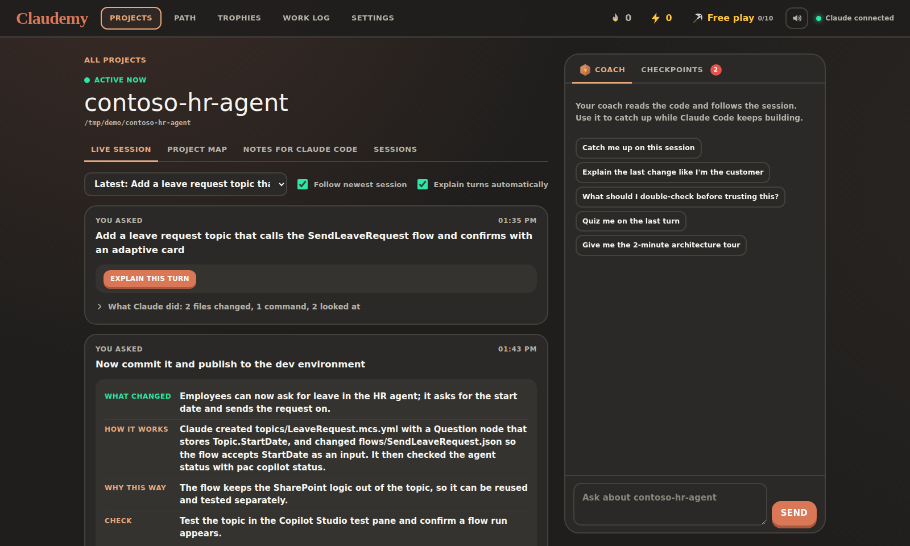
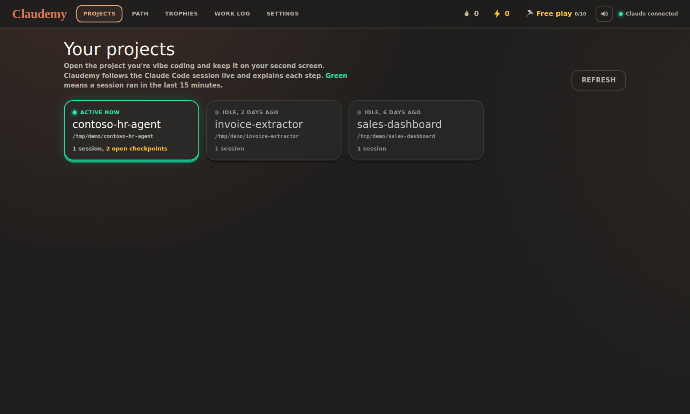
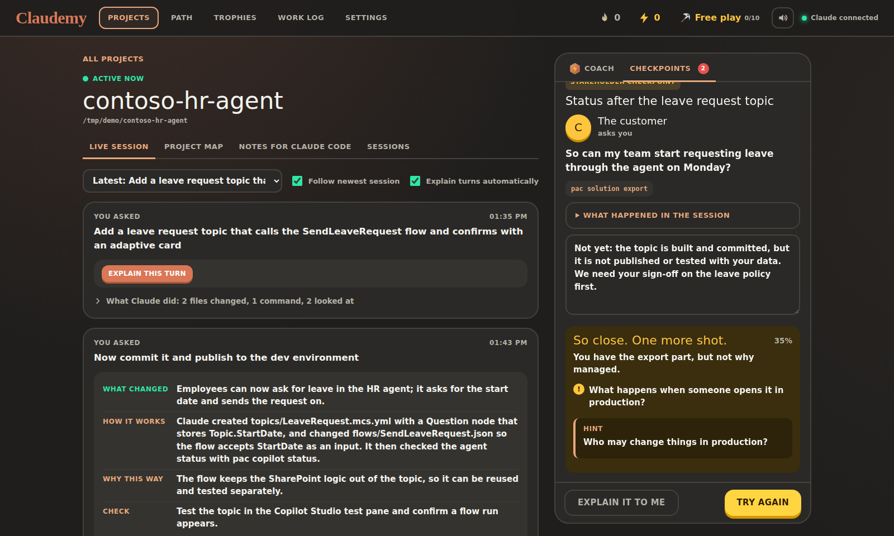
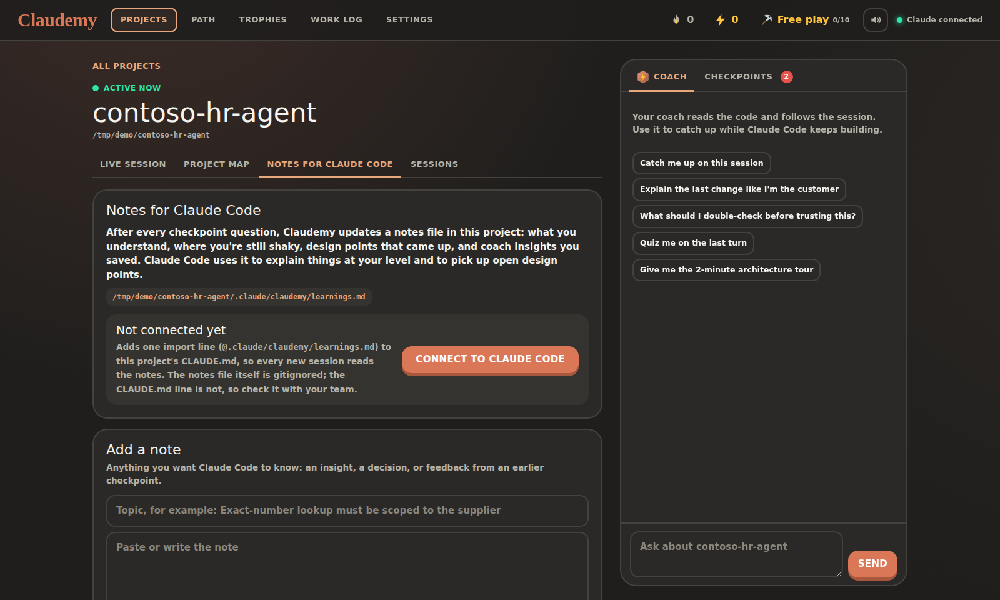
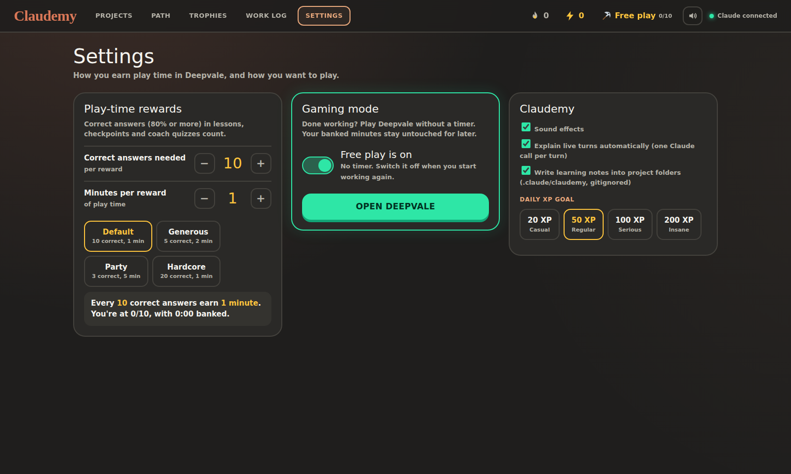
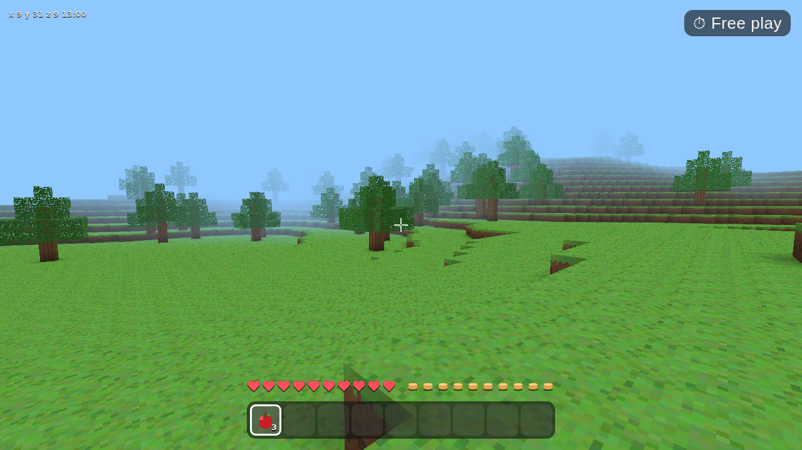
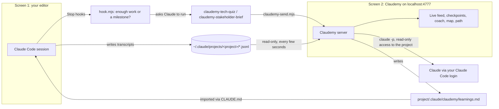

# Claudemy

**A second-screen learning companion for Claude Code.** While Claude Code builds on one screen, Claudemy follows the session live on the other: it explains every turn functionally and technically, quizzes you with checkpoints, coaches you through what you don't get yet, and writes what you learned back into a file Claude Code reads. The goal: you can explain, defend and debug everything Claude built for you, even without AI.

Runs locally, on your own Claude subscription, through the Claude Code CLI you already use. No API key, no npm dependencies.



## Contents

- [What it does](#what-it-does)
- [Before you start: the Claude Code projects folder](#before-you-start-the-claude-code-projects-folder)
- [Quick start](#quick-start)
- [The two-screen workflow](#the-two-screen-workflow)
- [Checkpoints: the skills and hooks](#checkpoints-the-skills-and-hooks)
- [Notes for Claude Code](#notes-for-claude-code)
- [Path, trophies and Deepvale](#path-trophies-and-deepvale)
- [Configuration](#configuration)
- [Privacy and costs](#privacy-and-costs)
- [Troubleshooting](#troubleshooting)
- [How it works](#how-it-works)

## What it does

| | |
|---|---|
| **Live session** | Follows your Claude Code session every few seconds. Each prompt becomes a turn: which files changed (with diffs), which commands ran (with output and errors), Claude's plan. When a turn is done, Claudemy explains *what changed*, *how it works*, *why this way* and *what to check*. |
| **Checkpoints** | Two Claude Code skills write quiz questions about the work while you build: **tech checkpoints** (what Claude built, ran and configured) and **stakeholder checkpoints** (can you tell the customer, consultant, IT admin or architect where things stand and why). Claudemy's tutor asks them, grades them, hints after a miss and explains after the second try. |
| **Coach** | A tutor next to the feed that reads your code and follows the session: "catch me up", "explain the last change like I'm the customer", "quiz me on the last turn". |
| **Notes for Claude Code** | What you understand, where you're shaky, and design gaps that came up are written to `.claude/claudemy/learnings.md` in your project, so the next Claude Code session knows your level and your open design points. |
| **Project map** | What the project is, how it fits together, where it breaks first, techniques to master, and a file tree with an explanation per file. |
| **Path, XP and Deepvale** | Spaced repetition lessons, XP, streaks, ranks, badges, certificates, and an original voxel survival game you unlock play time for by answering correctly. |

<p align="center">
  
  
</p>

## Before you start: the Claude Code projects folder

Claudemy doesn't have its own list of projects. It reads **Claude Code's own session history**, which lives in one folder per project:

```
~/.claude/projects/<project>/<session-id>.jsonl          macOS / Linux
%USERPROFILE%\.claude\projects\<project>\<session-id>.jsonl   Windows
```

Claude Code creates `~/.claude/projects/<project>` automatically the first time you run a session in a folder. The folder name is the project's path with separators replaced by dashes, for example `C--Users-you-Projects-helpdesk-agent`. Every session in that project adds a `.jsonl` transcript there. Claudemy uses those transcripts to:

- list your projects (green when a session ran in the last 15 minutes),
- follow the live session and explain each turn,
- know which project a checkpoint belongs to.

**So, for a project to show up in Claudemy, you need to have worked on it with Claude Code at least once:**

```sh
cd path/to/your/project
claude            # start Claude Code here and send one message
```

That's all; there's nothing to configure in the project itself. A few things to know:

- **Use the Claude Code CLI or the VS Code extension** in the project folder. Both write to `~/.claude/projects`. Chats on claude.ai don't.
- **Custom location?** If you set `CLAUDE_CONFIG_DIR` for Claude Code, set the same variable for Claudemy. You can also point Claudemy straight at the folder with `CLAUDE_PROJECTS_DIR`.
- **Claudemy only reads these files.** It never changes them.
- **Old projects** whose folder no longer exists still appear (marked "folder missing"); the live feed and history work, but the project map and coach can't read code.

## Quick start

**Requirements**

- [Node.js](https://nodejs.org) 18 or newer.
- [Claude Code](https://code.claude.com/docs/en/overview), installed and logged in with your Claude plan. Check with `claude --version`.
- At least one project you've worked on with Claude Code (see above).
- An internet connection for fonts and the game's 3D library.

Works on Windows, macOS and Linux.

**Install**

```sh
git clone https://github.com/<your-account>/claudemy.git
cd claudemy
node setup.mjs
```

`setup.mjs` checks Node.js and Claude Code, counts your Claude Code projects, and installs the two skills and their hooks into `~/.claude` (it backs up your `settings.json` first and keeps your existing hooks).

Then **restart Claude Code** so it loads the skills and hooks. Check with `/skills` (both `claudemy-…` skills listed) and `/hooks` (two Stop hooks).

**Run**

```sh
npm start          # or: node server.js
```

Open **http://localhost:4777**. On Windows you can double-click `start.cmd`; on macOS and Linux, run `./start.sh`.

## The two-screen workflow

1. **Screen 1:** your editor with Claude Code, as usual.
2. **Screen 2:** Claudemy, opened on the same project.
3. Prompt away. Each turn shows up within a few seconds and is explained when Claude is done. Checkpoints appear in the feed after a chunk of work and at milestones like a commit or deploy.
4. Answer checkpoints in the right-hand panel while the feed stays visible. Stuck? The coach gives a hint first and explains fully if you still don't get it.

## Checkpoints: the skills and hooks

The `claude-skills` folder holds two [Claude Code skills](https://code.claude.com/docs/en/skills), each with a [Stop hook](https://code.claude.com/docs/en/hooks):

| Skill | Writes | Its hook fires |
|---|---|---|
| `claudemy-tech-quiz` | A tech checkpoint about what Claude built, wrote, ran and configured | After 6 file changes or commands since the last tech checkpoint |
| `claudemy-stakeholder-brief` | An honest status brief plus questions from the customer, consultant, IT admin and architect | At milestones (git commit or push, PR, Power Platform solution export or import, Azure, azd or Function App deploy, terraform apply, publish), or after 30 actions |

When Claude is about to stop, each hook reads the session transcript and counts the work since its last checkpoint. Above the threshold it asks Claude to run the skill first; otherwise it does nothing. The skill writes the questions, a grading rubric, hints and the session context, and sends them to Claudemy with `claudemy-send.mjs`. If Claudemy isn't running, the checkpoint waits in `~/.claudemy/inbox` and is imported at the next start.

You can also ask for one any time: *"quiz me on what you just did"* or *"prep me for the customer meeting"*.

The first time a skill sends a checkpoint, Claude Code asks permission to run `node …/claudemy-send.mjs`; choose "don't ask again" for that command.

Details, tuning and uninstalling: [`claude-skills/README.md`](claude-skills/README.md).

## Notes for Claude Code



After every checkpoint question, Claudemy updates `.claude/claudemy/learnings.md` in your project:

- **Still shaky**: questions you missed, with your misconception and the correct understanding.
- **Understood**: insights you've shown you have.
- **Design points raised**: gaps in the project itself that surfaced in a question, as open items.
- **Notes from the coach**: anything you kept with "Save to notes", plus notes you add yourself.
- **Checkpoint log**: questions, your answers, scores and model answers.

The folder gets its own `.gitignore`, so the notes never end up in the repository. On the project's **Notes for Claude Code** tab, **Connect to Claude Code** adds one import line (`@.claude/claudemy/learnings.md`) to the project's `CLAUDE.md`, so every new session loads them. That line does live in the repo, so agree on it with your team. The two skills also read the notes, so new checkpoints revisit your weak spots.

## Path, trophies and Deepvale

- **Path**: your skills as nodes from New to Expert, with lessons written for your level and spaced repetition. Techniques from a project map can be added with one click.
- **XP, streaks, ranks, badges** and a printable **certificate of mastery** for every skill you take to Expert.
- **Deepvale**: an original voxel survival game (mining, building, crafting, hunger, day and night) that runs in your browser and saves your world between sessions. By default, every 10 correct answers (80% or more) earn 1 minute of play time. Change both numbers in **Settings**, or switch on **free play** when you're done working.

<p align="center">
  
  
</p>

## Configuration

Most things are in the **Settings** page. Environment variables, set before starting Claudemy:

| Variable | Default | What it does |
|---|---|---|
| `PORT` | `4777` | Port of the local website |
| `TUTOR_LANG` | `English` | Language of explanations, questions and the coach, for example `Dutch` |
| `CLAUDEMY_ABOUT` | empty | A sentence about you, so the tutor pitches things right, for example `I build Copilot Studio agents for small businesses` |
| `CLAUDE_MODEL` | your Claude Code default | Model alias for the tutor, for example `sonnet` |
| `CLAUDE_BIN` | `claude` | Full path to the Claude Code CLI if it isn't on your PATH |
| `CLAUDE_CONFIG_DIR` | `~/.claude` | Where Claude Code keeps its data (use the same value as for Claude Code) |
| `CLAUDE_PROJECTS_DIR` | `$CLAUDE_CONFIG_DIR/projects` | Override just the projects folder |
| `ACTIVE_MINUTES` | `15` | How recent a session must be for a project to show green |
| `CLAUDEMY_INBOX` | `~/.claudemy/inbox` | Where checkpoints wait while Claudemy is offline |

Hook tuning (`CLAUDEMY_HOOKS=off`, `CLAUDEMY_TECH_THRESHOLD`, `CLAUDEMY_BRIEF_THRESHOLD`) is in [`claude-skills/README.md`](claude-skills/README.md).

PowerShell example:

```powershell
$env:TUTOR_LANG = "Dutch"; $env:CLAUDEMY_ABOUT = "I build AI agents on the Microsoft stack"; npm start
```

## Privacy and costs

**What stays on your machine:** everything Claudemy stores lives in `data/` (progress, chats, project maps, turn explanations, your game world), in `~/.claudemy/inbox`, and in each project's gitignored `.claude/claudemy/` folder. `data/` is in `.gitignore`. The website only listens on `127.0.0.1`.

**What goes to Claude:** explanations, grading and the coach run through your local Claude Code CLI (`claude -p`), the same way your Claude Code sessions send your code to Claude. When Claudemy reads a project, it gives Claude **read-only** access to that one folder (`--add-dir` with only `Read`, `Glob` and `Grep`; editing tools and the shell are blocked). Tutor sessions run in Claudemy's own sandbox folder, so they don't show up as activity in your project. `.env` files, keys, certificates, `node_modules` and lock files are left out of the file list, and the prompts tell Claude never to open secrets. Treat that as a guardrail, not a guarantee.

**Costs and usage:** there is no API key. Calls go through your logged-in Claude Code and count toward your plan's usage (headless `claude -p` usage has its own allowance on recent plans; see the Claude Help Center for the current rules). The biggest consumer is automatic turn explanations, one call per turn; switch them off in Settings or in the live view if you'd rather click "Explain this turn" yourself.

**One install per person.** Run Claudemy on your own machine with your own Claude login. Don't host one instance for a team on a single account: routing other people's requests through your subscription is against Anthropic's terms.

## Troubleshooting

| Problem | Fix |
|---|---|
| "Claude CLI not found" (red dot, top right) | Run `claude --version` in a terminal. If that works there but not in Claudemy, set `CLAUDE_BIN` to the full path (`where claude` on Windows, `which claude` elsewhere). |
| No projects listed | Claudemy shows the folder it reads. Run `claude` in a project folder and send one message, then refresh. Using a custom `CLAUDE_CONFIG_DIR`? Set it for Claudemy too. |
| A project shows "folder missing" | The folder in the transcripts no longer exists on this machine (moved, renamed or on another computer). |
| Checkpoints never appear | Restart Claude Code after `node setup.mjs`, and check `/hooks`. Run `claude --debug` to see whether the Stop hooks fire. Make sure you approved the `claudemy-send.mjs` command. |
| "Build project map" fails or takes long | Large projects can take several minutes. Errors from the CLI are shown as a message; try again, or explain files one by one in the tree. |
| The game shows "Claudemy is not running" | Open the game from Claudemy (the pickaxe chip in the top bar), with Claudemy running. |

## How it works



**Project structure**

```
claudemy/
├── server.js                 Local server: projects, live feed, tutor, checkpoints, notes, game API
├── public/
│   ├── index.html            The Claudemy app (single file, no build step)
│   └── game.html             Deepvale
├── claude-skills/
│   ├── install.mjs           Installs the skills into ~/.claude/skills and the hooks into settings.json
│   ├── claudemy-tech-quiz/    SKILL.md, hook.mjs, claudemy-send.mjs
│   └── claudemy-stakeholder-brief/
├── setup.mjs                 One-time setup and environment check
├── start.cmd / start.sh      Start and open the browser
└── data/                     Your progress (created on first start, gitignored)
```

## Contributing

Issues and pull requests are welcome. Claudemy deliberately has no dependencies and no build step: the server is plain Node.js and the front end is a single HTML file. To work on it without spending Claude usage, point `CLAUDE_BIN` at a small script that reads the prompt from stdin and prints a `{"type":"result","result":"...","session_id":"..."}` JSON line, like `claude -p --output-format json` does.

## License

[MIT](LICENSE). Claudemy is an independent project and is not affiliated with or endorsed by Anthropic. Claude and Claude Code are trademarks of Anthropic.
